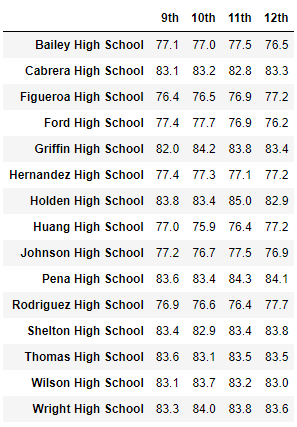

# RBCModule4-Challenge

# Overview of the School Disctrict Analysis
This analysis's purpose is to exemplify the use of the pandas library for Python by exploring basic DataFrame functionality including slicing, modifying, groupby (*Python equivalent of MS Excel PivotTable*), and summarization functions. 

Our storyline is that the 9th grade math and reading grades have been tampered with and so we have been ordered to remove them and perform analysis without them. We will compare the results of the two analyses to see if there is much change.

# Results
## District Summary
### Original

### Updated

### Difference
Here we see that all of our score have dropped slightly due to removing all 9th grade Math and Reading from our calculations.

## Per School Summary
### Original

### Updated

### Difference
Like the District Summary, all score averages for Thomas High School have diminished slightly, however the overall passing rate has increased a dramatic 7 percentage points. 

## Top and Bottom Schools Standings
### Original Top 5

### Updated Top 5

### Original Bottom 5

### Updated Bottom 5

### Difference
Here we see the change we have made has put Thomas High School from the #2 spot in the standings to the #1 spot, however this may be misleading since we removed all 9th grade scores in the process. 

## Math and Reading Scores by Grade
### Math Scores by Grade
| Original | Updated |
|-|-|
|  |  |

### Reading Scores by Grade
| Original | Updated |
|-|-|
|  |  |

### Difference
There is nothing of interest here to note except to confirm that we have indeed removed the grades of 9th graders in Thomas High School as indicated by the replacement with *nan*.

## Scores by School Spending
### Original

### Updated

### Difference
Here we see a significant change in values with both the **$585-629** and the **630-644** categories of spending ranges seing significant improvements in their scores. It is a bit odd that we see a difference in two categories given that only data for one category should have been modified, so either I am incorrect about this assumption or we have made an error somewhere. 

## Scores by School Size
### Original

### Updated

### Difference
We see there isn't much noticible difference scores by School Size except for the 1 point gain in the **% Overall Passing** for the **Medium** sized schools. 

## Scores by School Type
### Original

### Updated

### Difference
We see there isn't much noticible difference scores by School Type except for the 1 point gain in the **% Overall Passing** for the **Charter Schools**. 

# Summary
In summary, we can see that in the new analysis:

1. The grades of the 9th graders in Thomas High School were successfully changed to *nan*.
2. This causes slightly lower averages of scores for Thomas High School and all summarized categories that contain Thomas High School. 
3. It also increases the overall passing rate significantly of students at Thomas High School from ~90% to ~97%.
4. These changes would put Thomas High School in #1 overall standing for success however such a change would be misleading since we're ignoring the 9th grade data. 